# Reading intrinsic and induced DNA shape: how the conformational ensemble sees TF–DNA recognition

*A DNA-shape-centred reading of the BioEmu-augmented DeepPBS results, framed against
Jiang, Shewchuk, Chiu, Li, Kribelbauer-Swietek, Gompel & Rohs, "Readout of intrinsic and
induced DNA shape by homeodomain transcription factor complexes" (Biophys. J., 2026).*

---

## 0. The one-paragraph version

Transcription factors read DNA through two channels: the **intrinsic shape** the sequence
already encodes (read by *conformational selection*), and the **protein-induced
deformation** the TF imposes on binding (read by *induced fit*). The Jiang/Shewchuk paper
makes these two channels measurable in a single complex through two observables of the
minor groove — its **width (MGW)**, which is intrinsic, and its **fluctuation (MGW-FL)**,
which reports protein-induced stabilization — and shows that AlphaFold3, while good at the
static shape, is blind to the fluctuation channel, motivating an AF→MD→DeepPBS workflow.
**This project is that workflow at benchmark scale**, with BioEmu conformational ensembles
standing in for per-complex MD. Read through the paper's lens, our results say: the
minimized ensembles faithfully preserve intrinsic MGW (conformational selection works),
they recover the DNA flexibility AF3 collapses (the paper's central negative result, now
across twelve TFs), and **engrailed** — a homeodomain the paper studies directly — is the
clean exemplar of a conformational-selection reader: a near-rigid groove, a null
augmentation effect, no induced deformation for the ensemble to either capture or corrupt.

---

## 1. The framework the paper gives us

The paper's conceptual contribution is a **two-observable decomposition of DNA shape**:

| observable | what it is | which recognition channel |
|---|---|---|
| **MGW** (minor-groove width) | the groove geometry the sequence intrinsically encodes | **conformational selection** — the protein reads a shape the DNA already holds |
| **MGW-FL** (SD of MGW across an ensemble) | how much that width *fluctuates* — reduced where a protein clamps the backbone | **induced fit** — the protein stabilizes a specific deformed conformation |

Their central claims, in order:

1. **DNA shape is context-dependent.** Even the same TF reads different shape signatures
   depending on flanking sequence and affinity; the balance of the two channels shifts with
   context, and the difference between channels is strongest at high-affinity sites.
2. **Binding lowers MGW-FL at contacts.** In the Hth-Exd-Scr trimer, minor-groove
   fluctuation drops 26–36 % at the charged-residue contact positions — the mechanical
   signature of induced fit.
3. **AF3 is blind to the fluctuation channel.** AF3 reproduces static MGW well
   (Pearson ≈ 0.84 vs crystal) but its multi-seed samples give **flat, uninformative
   MGW-FL** and it barely responds to mutations. Recovering dynamics requires physical
   simulation.
4. **The fix is a hybrid pipeline:** AF for a fast scaffold → MD for induced fit and local
   fluctuation → DeepPBS for residue-level readout. **This is precisely the architecture of
   the TF-conformation project**, with BioEmu providing the conformational sampling.

Everything below reads our results as a benchmark-scale test of claims 1–4.

---

## 1b. Three different ways we measure "induced fit vs conformational selection"

This is worth stating plainly up front, because the project computes **three distinct
metric families** that all get loosely called "the mechanism," and they are *not* one axis.
They measure different molecules and different physics, and they can agree or diverge. Every
per-TF number in this document belongs to one of these three families, and I label which:

| family | measured on | quantity | what a high value means |
|---|---|---|---|
| **A. Static crystal DNA deformation** | the **bound DNA** in the crystal | `induced_fit_index` = mean z-score of \|crystal bend − 0°\| and \|crystal MGW − 5.7 Å\| | the bound DNA is far from canonical B-DNA — the protein imposes a large *static* deformation (induced-fit-like) |
| **B. Protein reachability** | the **free protein** ensemble | `conf_selection_index` = −z(`d_min`), where `d_min` is how close the unbound protein ensemble gets to its bound pose | the free protein already samples its bound conformation — recognition needs little protein rearrangement (conformational-selection-like, **on the protein side**) |
| **C. DNA ensemble fluctuation** | the **minimized DNA** ensemble | `bend_iqr` (global helical-bend IQR) and `MGW-FL` (SD of minor-groove width) | the DNA's *shape fluctuates* across the ensemble — the dynamic axis |

Three cautions that resolve most of the confusion:

1. **A and B are not two ends of one ruler.** Family A is a *static DNA* measure (how bent
   is the crystal); family B is a *protein-dynamics* measure (does the free protein reach its
   pose). The pipeline names them "induced-fit index" and "conformational-selection index" and
   combines them only by subtraction into a heuristic `mechanism_score` — but they answer
   unrelated questions and are z-scored on different distributions. A TF can score high on
   both (TBP does: its crystal DNA is extremely kinked **and** its free protein reaches its
   pose well).
2. **Family C is the one that predicts the augmentation effect** — specifically `bend_iqr`
   (ρ = −0.53), *not* `MGW-FL` (ρ = −0.09) and *not* the static family A index (ρ ≈ +0.04).
   This is the working axis of the mechanism chapter.
3. **The paper's framing is family C on the DNA** (MGW = intrinsic shape, MGW-FL =
   induced-fit fluctuation). So when we connect to the paper we use family C; when we quote
   the pipeline's named indices we are in families A and B, which are different measurements
   and are labeled as such below.

The three exemplars (§3) are chosen precisely because they show these families *diverging* —
which is itself the most informative thing here.

---

## 2. Conformational selection works: the ensemble preserves intrinsic MGW

The first thing to establish is that the minimized ensembles carry the DNA's *intrinsic*
shape — otherwise nothing downstream is trustworthy. They do, almost perfectly.

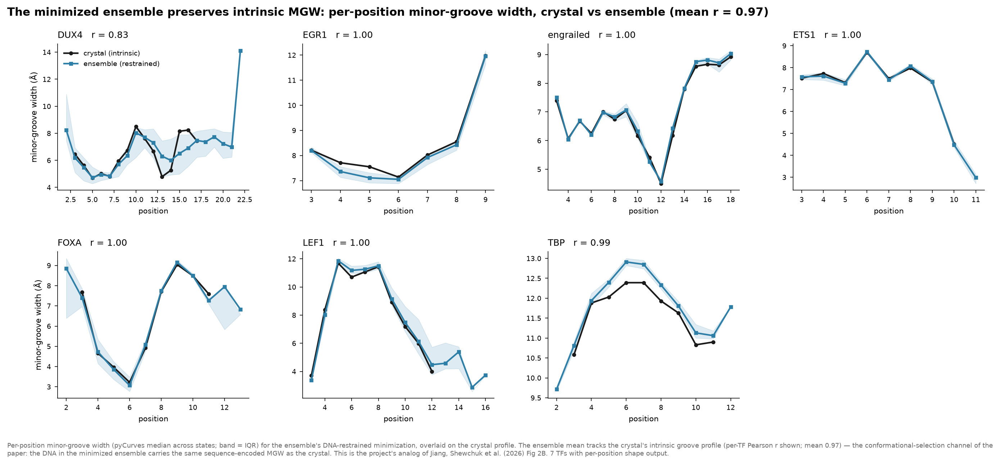

Per-position minor-groove width in the minimized ensemble tracks the crystal profile with a
**mean Pearson r = 0.97** across the seven TFs with per-position shape output; five of seven
are at r ≥ 0.99. DUX4 is the sole partial exception (r = 0.83), consistent with it being
the most conformationally dynamic TF in the panel. This is the project's analog of the
paper's Fig. 2B: the DNA in the ensemble is the same sequence-encoded groove the crystal
has — the conformational-selection channel is intact.

Extending this across **all five pyCurves shape descriptors** shows the same picture, with a
feature-dependent gradient:

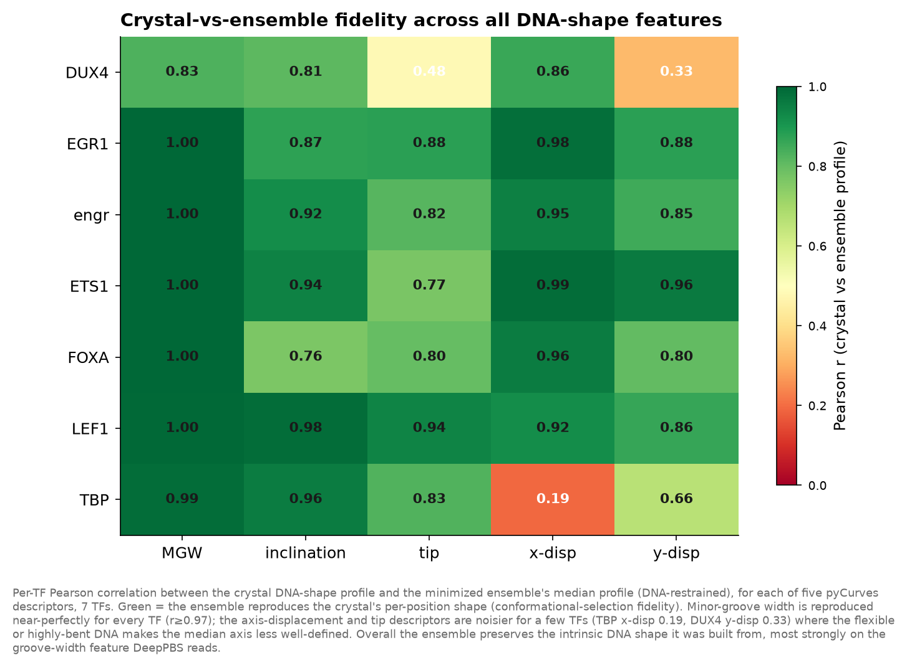

Minor-groove width — the feature DeepPBS most directly reads — is reproduced near-perfectly
for every TF (r ≥ 0.97). The axis-displacement and tip descriptors are noisier for a few
individual cells (TBP x-displacement r = 0.19; DUX4 y-displacement r = 0.33), where highly
bent or flexible DNA makes the median helical axis less well-defined. The takeaway is that
the ensemble preserves intrinsic shape most strongly on exactly the feature that matters for
readout.

---

## 3. Engrailed: a conformational-selection reader of intrinsic shape

The paper studies engrailed (En) directly — it is one of the two single-homeodomain TFs it
uses to dissect intrinsic-vs-induced readout — which makes it the ideal bridge between the
paper and our benchmark. Every number we have classifies it the same way.

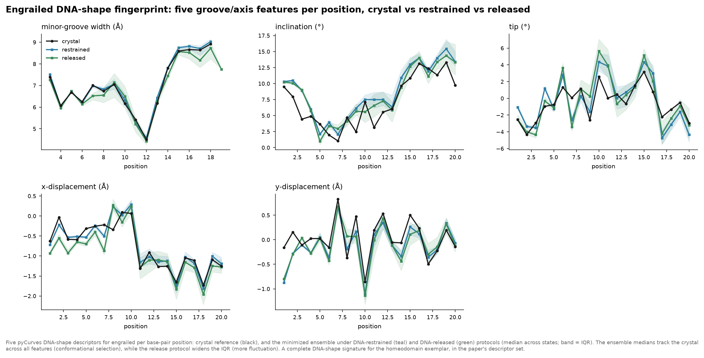

Across all five shape descriptors, engrailed's ensemble medians (restrained and released)
sit essentially on top of the crystal profile — the DNA holds its intrinsic shape. The
DNA-released minimization protocol widens the fluctuation band but does not move the median.

The three-panel view makes the mechanism explicit:

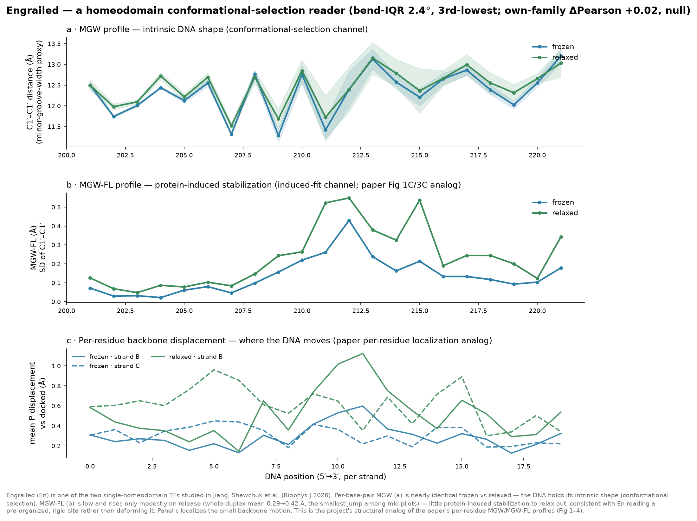

- **Panel a (MGW):** the minor-groove-width profile is nearly identical whether the DNA
  backbone is held (k = 10) or released (k = 1.5) — intrinsic shape, protocol-independent.
- **Panel b (MGW-FL):** fluctuation is low and rises only modestly on release (whole-duplex
  mean 0.29 → 0.42 Å, one of the smallest jumps in the panel) — there is little
  protein-induced stabilization to relax out.
- **Panel c (per-residue displacement):** localizes the small backbone motion, the project's
  structural analog of the paper's per-residue MGW-FL localization.

Its quantitative profile:

| family | quantity | engrailed | reading |
|---|---|---|---|
| **C** DNA fluctuation | DNA-bend IQR | **2.44°** (3rd-lowest of 13) | rigid DNA ensemble |
| **C** DNA fluctuation | MGW-FL, restrained → released | 0.286 → 0.423 Å | little groove fluctuation |
| **B** protein reachability | conf-selection index (−z d_min) | **+0.649** (d_min 0.69 Å) | free protein reaches its pose |
| **A** static crystal | induced-fit index | **−0.324** | crystal DNA near B-DNA (not deformed) |
| — outcome | cross-benchmark ΔPearson | **+0.016** (CI −0.026 … +0.058) | null |
| — outcome | own-family ΔPearson | **−0.015** (CI −0.102 … +0.071, p = 0.67) | null |

So engrailed reads a **pre-organized, near-rigid site by conformational selection**. And
this is *why* its augmentation effect is a null rather than a win or a loss: with almost no
protein-induced deformation, there is little for a conformational ensemble to either capture
(which would help) or corrupt with off-target shapes (which would hurt). The paper tells us
the mechanism; the benchmark shows the consequence.

### The induced-fit contrast: TBP

The engrailed panel earns its meaning from a contrast, so the same analysis run on the
opposite mechanism is the natural companion. TBP is the canonical induced-fit reader — it is
the extreme of the panel on the induced-fit axis.

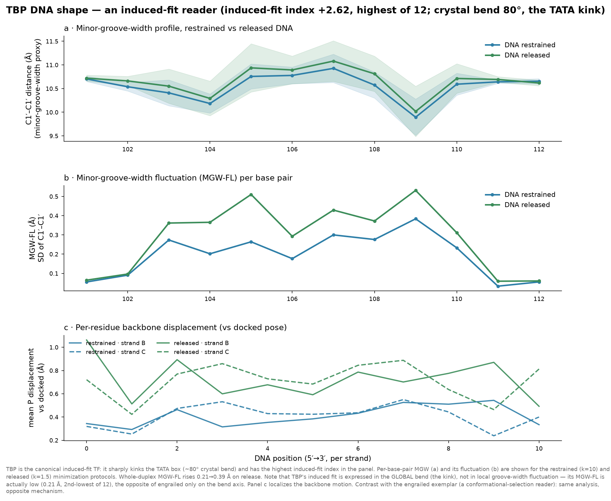

| family | quantity | TBP | reading |
|---|---|---|---|
| **C** DNA fluctuation | DNA-bend IQR | **11.78°** (2nd-highest of 13) | highly dynamic global bend |
| **C** DNA fluctuation | MGW-FL, restrained → released | 0.212 → 0.393 Å | **low** groove-width fluctuation |
| **A** static crystal | crystal bend | **79.7°** | the TATA-box kink |
| **A** static crystal | induced-fit index | **+2.62** (highest of 13) | crystal DNA extremely deformed |
| **B** protein reachability | conf-selection index (−z d_min) | **+0.688** (d_min 0.59 Å, best of 3 exemplars) | free protein *also* reaches its pose |
| — outcome | cross-benchmark ΔPearson | **−0.012** (CI −0.056 … +0.033) | non-significant negative |
| — outcome | own-family ΔPearson | **−0.031** (CI −0.144 … +0.082, p = 0.51) | non-significant negative |

*(Two distinct seed-level effects are reported: the **cross-benchmark** effect on the shared
general-130 set, and the **own-family** effect on each TF's own held-out family. They are
different quantities and can differ in sign; both are quoted for every TF so the comparison
is consistent.)*

TBP is the sharpest possible contrast to engrailed, and it shows all three metric families
diverging in one structure:

- **Family A (static crystal) says extreme induced fit:** TBP kinks the TATA box by ~80° and
  widens the minor groove, giving the highest induced-fit index in the panel (+2.62). By the
  static-deformation definition, TBP is the induced-fit TF.
- **Family B (protein reachability) says "high selection":** yet the free TBP protein
  ensemble reaches its bound pose *well* (d_min 0.59 Å, the best of the three exemplars), so
  the protein-side conformational-selection index is also high (+0.69). This is not a
  contradiction — it says the **protein** barely rearranges while the **DNA** is massively
  deformed. Induced fit here is imposed *on the DNA*, not accommodated by the protein.
- **Family C (DNA fluctuation) splits:** TBP's global bend-IQR is high (11.8°, 2nd of 13) —
  the kink is dynamic — but its local MGW-FL is *low* (0.21 Å, 2nd-lowest, below engrailed's).

So "induced fit" is emphatically **not one number.** TBP imposes a huge global bend (families
A and C-bend) while barely perturbing local groove-width fluctuation (C-MGW-FL) and barely
rearranging its own protein (B). The paper's MGW-FL captures the groove-fluctuation flavour;
the static index captures the crystal-deformation flavour; bend-IQR captures the bending
flavour — and TBP shows they need not co-occur.

On the augmentation outcome, both TFs land at a non-significant cross-benchmark effect
(engrailed +0.016, TBP −0.012; CIs cross zero). On the own-family effect both are also
non-significant (engrailed −0.015, TBP −0.031). TBP's negative sign is consistent with the
project's overall reading that high-bend, induced-fit-leaning TFs tend to be hurt rather than
helped (a broad ensemble injects off-target versions of the specific kink), but at the per-TF
level the effect is within noise. The clean statistical separation lives at the
axis-correlation level (§6), not in any single pilot.

### A conformational-selection reader that augmentation *helps*: ETS1

Engrailed shows that a rigid, low-fluctuation site can give a **null** effect. ETS1 — read
with the same analysis — shows that low fluctuation does not have to mean "nothing happens":
it can mean **helped**. This is the third corner of the story.

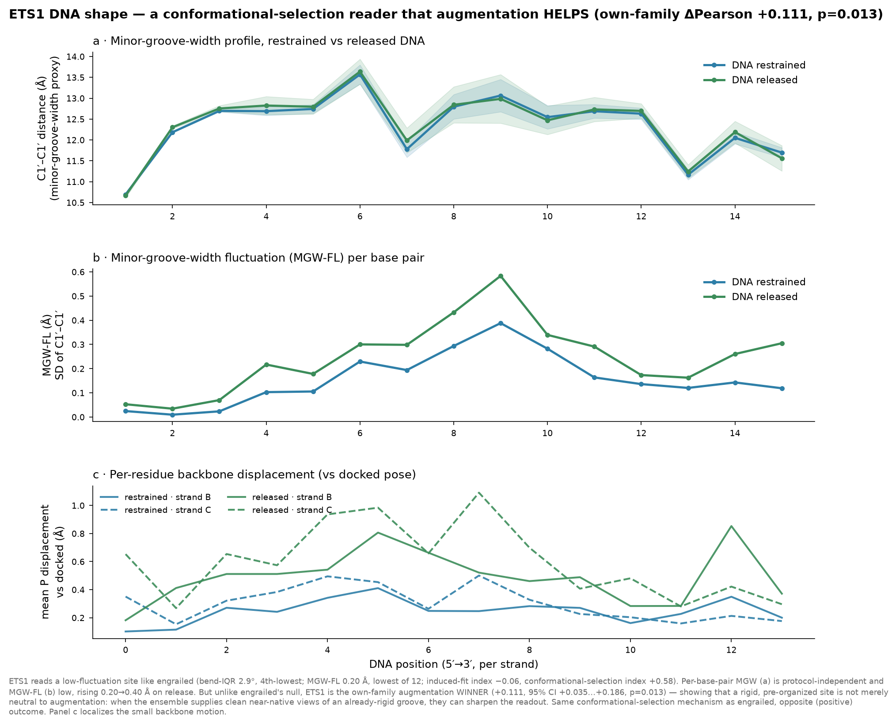

| family | quantity | ETS1 | reading |
|---|---|---|---|
| **C** DNA fluctuation | DNA-bend IQR | **2.91°** (4th-lowest of 13) | rigid DNA, like engrailed |
| **C** DNA fluctuation | MGW-FL, restrained → released | 0.197 → 0.404 Å (**lowest** frozen of 12) | minimal groove fluctuation |
| **A** static crystal | induced-fit index | **−0.06** | crystal DNA near B-DNA |
| **B** protein reachability | conf-selection index (−z d_min) | **+0.58** (d_min 0.87 Å) | free protein reaches its pose |
| — outcome | cross-benchmark ΔPearson | −0.002 (CI −0.036 … +0.031) | null |
| — outcome | own-family ΔPearson | **+0.111** (CI +0.035 … +0.186, **p = 0.013**) | **significantly helped** |

Structurally ETS1 is engrailed's twin: protocol-independent MGW, the lowest whole-duplex
MGW-FL in the panel, a strongly conformational-selection profile. But on its **own family**
it is the single clearest augmentation winner — a significant +0.111. The reading is that
when a TF reads an already-rigid, pre-organized groove, a physical conformational ensemble
does not inject harmful off-target shapes (there are none to inject); instead it supplies
clean, near-native views of that rigid site, which can *sharpen* the learned readout. Same
conformational-selection mechanism as engrailed, opposite (positive) outcome — and the
contrast tells you that the low-fluctuation regime is where augmentation is *safe to help*,
while the high-fluctuation regime (TBP, DUX4) is where it risks hurting.

**The three exemplars together** map the mechanism cleanly:

| TF | dynamic regime | mechanism | own-family effect |
|---|---|---|---|
| **ETS1** | low fluctuation | conformational selection | **+0.111 (helped, p = 0.013)** |
| **engrailed** | low fluctuation | conformational selection | −0.015 (null) |
| **TBP** | high global bend | induced fit (via kink) | −0.031 (null / leaning negative) |

Low-fluctuation conformational-selection readers span null-to-helped; the high-bend
induced-fit reader leans negative. That is the augmentation-sign story in three structures.

---

## 4. Induced fit, at the resolution where it lives

The paper's induced-fit signature is **position-resolved** — MGW-FL drops at specific
contact positions, not uniformly. Reproducing that requires per-position analysis, not a
single number per TF.

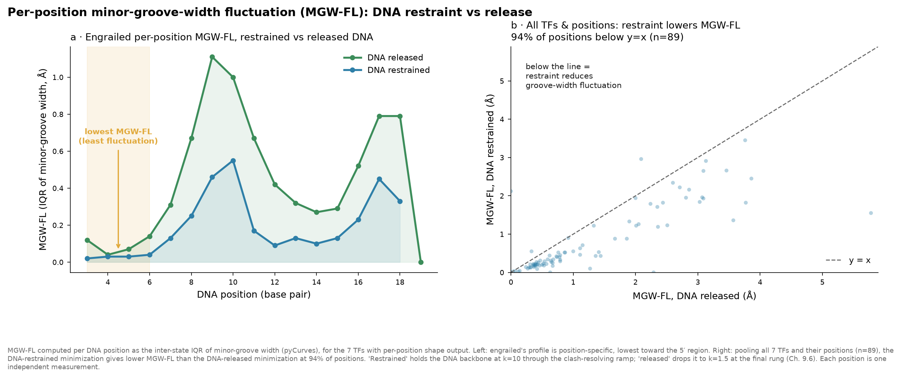

Computed per DNA position as the inter-state IQR of minor-groove width, the restrained
minimization gives lower MGW-FL than the released minimization at **94 % of positions
(n = 89 across 7 TFs)**. Engrailed's own profile (panel a) is position-specific, with the
lowest fluctuation toward its recognition region. This is the paper's protein-induced
groove-stabilization signature, reproduced across the benchmark.

**A deliberate methodological choice underlies this figure.** I did *not* compute a
per-benchmark-entry version of the MGW-FL–vs–effect correlation, even though it would look
like finer resolution — because MGW-FL is intrinsically one value per TF (a property of that
TF's own DNA ensemble), while the benchmark entries are foreign structures. Broadcasting one
MGW-FL across a TF's many entries would replot the same point N times, inflating n with no
new information — textbook pseudoreplication. The **per-position** analysis is the honest
finer-resolution version: each position is a genuinely independent measurement, and it maps
onto the paper's actual (position-resolved) claim.

MGW-FL itself spans a wide range across TFs:

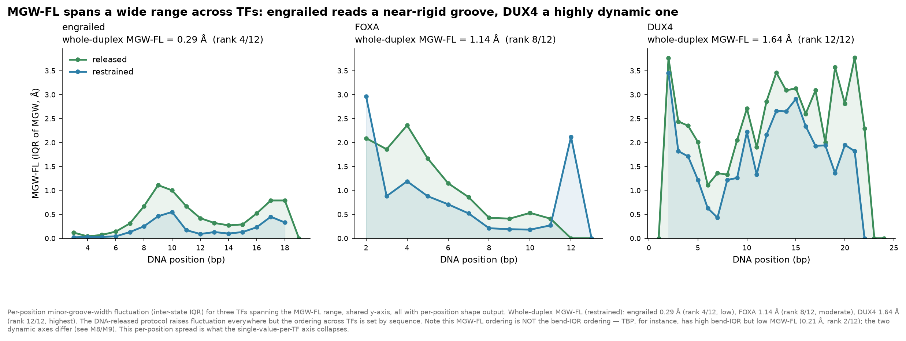

Engrailed reads a near-rigid groove (whole-duplex MGW-FL 0.29 Å, rank 4/12), FOXA an
intermediate one (1.14 Å, rank 8/12), and DUX4 a highly dynamic one (1.64 Å, rank 12/12).
Note the important caveat annotated on the figure: **this MGW-FL ordering is not the
bend-IQR ordering** — TBP, for instance, is high on global bend-IQR but low on MGW-FL
(0.21 Å, rank 2/12). The two "dynamic" axes are not interchangeable, which is the subject of
the next section.

---

## 5. AF3 is blind to the fluctuation channel — across twelve TFs

This is the paper's central negative result, and our benchmark states it more strongly than
the paper does, because we have twelve TFs where the paper had one complex.

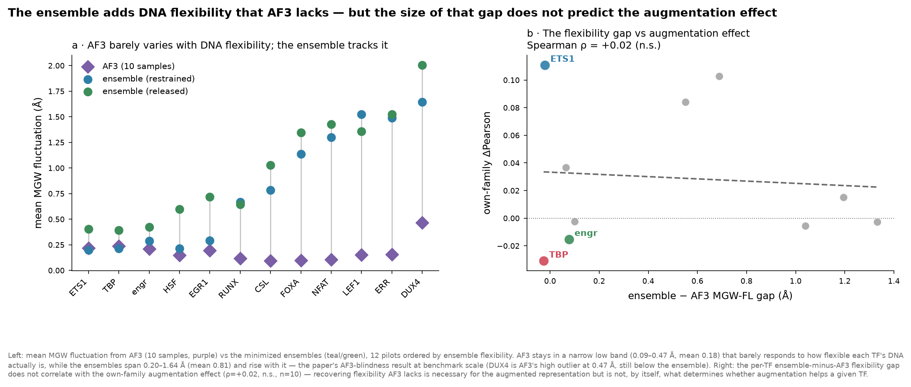

**Panel a** is the paper's Fig. 3B at benchmark scale: AF3 (10 samples) keeps MGW
fluctuation in a narrow low band — **0.09–0.47 Å (mean 0.18 Å)**, with DUX4 its lone high
outlier — that barely responds to how flexible each TF's DNA actually is, while the physical
ensembles fan out to **0.20–1.64 Å (mean 0.81 Å)** and rise with the true flexibility. AF3
compresses the DNA-flexibility axis toward a near-constant floor; the physics does not. This
is exactly the blindness that motivates adding conformational sampling in the first place.

**Panel b** asks the natural follow-up honestly: does the *size* of the ensemble-minus-AF3
flexibility gap predict where augmentation helps? It does **not** (Spearman ρ = +0.02,
n.s.). Recovering the flexibility AF3 lacks is *necessary* to build a physically meaningful
augmented representation, but the magnitude of that recovery is not, by itself, what decides
whether augmentation improves a given TF's readout. That decision lives elsewhere — which is
the honest limit of the story.

---

## 6. The two dynamic axes dissociate — and only one predicts the effect

A DNA-shape-literate reader will want to know: if MGW-FL is the paper's induced-fit axis,
does *it* predict our augmentation effect? The honest answer is **no — at per-TF resolution,
global bend flexibility does, and MGW-FL does not.** This is important enough that we keep
both axes rather than relabel one as the other.

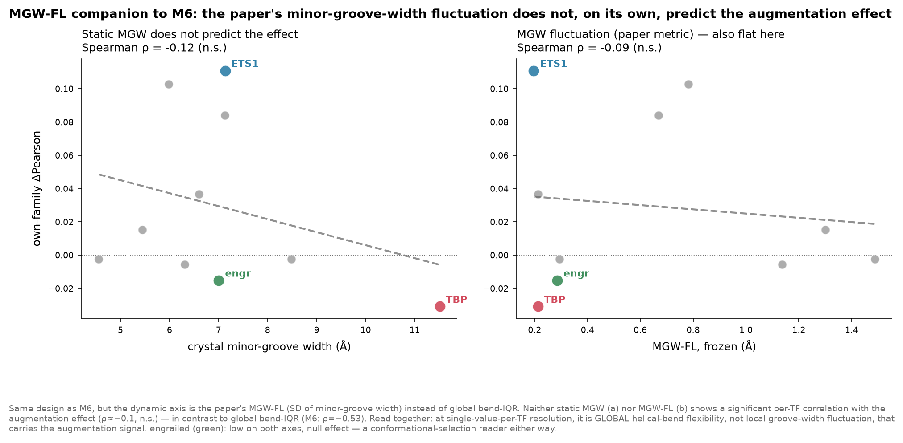

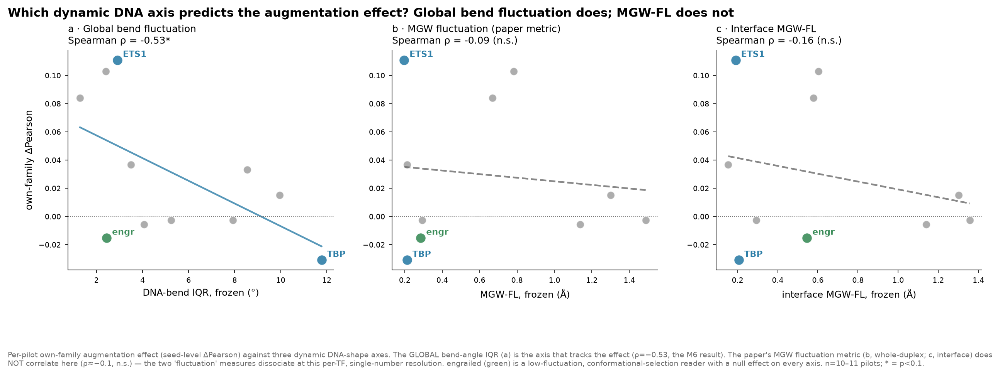

The correlations of each candidate axis with the own-family augmentation ΔPearson:

| dynamic axis | Spearman ρ vs effect | |
|---|---|---|
| **global DNA-bend IQR** | **−0.53** | the M6 result — the axis that tracks the effect |
| **MGW-FL** (paper's metric, whole-duplex) | −0.09 | not significant |
| **interface MGW-FL** | −0.16 | not significant |

The two "fluctuation" measures genuinely dissociate. **They agree in spirit** — both say the
dynamic behaviour of DNA matters — **but not in the specific observable.** Global helical
bend flexibility carries the augmentation signal at the per-TF resolution; local
minor-groove-width fluctuation does not. This is why the existing bend-IQR mechanism figures
(M4, M6, the quadrant) were left exactly as they are, and MGW-FL versions were built
alongside them rather than by relabeling: relabeling would have printed bend-IQR's −0.53
under MGW-FL's name, which is not what MGW-FL gives.

**Why do they dissociate?** Most likely resolution. The paper's MGW-FL correlations are
per-base-pair and per-affinity-bin; our per-TF collapse to a single MGW-FL number averages
away exactly the position- and context-dependence that carries the paper's signal. The
per-position analysis of §4 recovers that signal at the resolution where it lives; the
per-TF scalar that happens to predict our augmentation outcome is a different, coarser,
global quantity.

---

## 7. The unified reading

Putting the two instruments side by side:

- **The paper says:** static MGW (conformational selection) and dynamic MGW-FL (induced fit)
  are separate readout channels, and the dynamic one carries the protein-induced recognition
  signal that static shape misses.
- **The benchmark finds:** static crystal shape does not predict whether ensemble
  augmentation helps (ρ ≈ +0.04); a *dynamic* DNA property does (global bend-IQR, ρ = −0.53).

These are the same statement seen through two instruments: **the fluctuation of DNA shape —
not its static average — is where the mechanism lives.** That gives a clean reading of the
augmentation sign:

- **High DNA-shape dynamics → induced-fit-leaning → augmentation tends to hurt.** The bound
  complex is one specific, protein-stabilized conformation; a broad ensemble injects
  off-target dynamic shapes the DNA should not adopt in the bound state (TBP, DUX4, NFAT).
- **Low DNA-shape dynamics → conformational-selection-leaning → augmentation is
  neutral-to-helpful.** The DNA is pre-organized and rigid; ensemble frames supply real
  near-native views without corrupting anything (ETS1, **engrailed**).

Engrailed sits in the neutral corner — a conformational-selection reader of a rigid,
pre-organized site, with a null augmentation effect — and the paper explains *why*: its
homeodomain reads intrinsic MGW with only context-dependent fine-tuning, so there is little
induced deformation for an ensemble to add or remove.

---

## 8. Honest limits

1. **Restrained ≠ bound, released ≠ unbound.** Our frozen/relaxed contrast is a
   *minimization-protocol* knob (DNA backbone held at k = 10 vs released to k = 1.5), not the
   paper's biological bound-vs-unbound MD contrast. The two align in direction — releasing the
   restraint moves DNA toward higher, intrinsic-like fluctuation — but that mapping is an
   interpretation of the restraint, not an identity, and the figures here are labeled by the
   actual protocol, not the biological gloss.
2. **One number per TF erases context.** The paper's whole point is that the
   selection/induced-fit balance is sequence-context-dependent; our per-TF scalars collapse
   exactly that axis. The per-position analysis (§4) is the partial remedy; a full
   per-affinity-bin treatment is the natural next step.
3. **Coverage differs by metric.** The project has **13 pilots**. Per-position shape figures
   use the 7 with pyCurves per-position output (dux4, egr1, engrailed, ets1, foxa, lef1, tbp);
   whole-duplex **MGW-FL and the AF3 comparison cover 12** (irf has no DNA-shape output); and
   **bend-IQR / the static induced-fit index cover all 13**. Rank denominators in the tables
   above follow this: bend-IQR and induced-fit ranks are "of 13," MGW-FL ranks "of 12."
4. **AF3 comparison is whole-duplex.** The AF3-vs-ensemble MGW-FL contrast is per-TF mean;
   a per-position AF3 profile would require running pyCurves on the AF3 DNA models
   (`af3/af3_dna/`), which exist but were not processed for this pass.
5. **"Induced fit" and "conformational selection" are measured three different ways
   (§1b).** The pipeline's `induced_fit_index` is a *static crystal DNA-deformation* measure,
   its `conf_selection_index` is a *protein-reachability* measure, and bend-IQR/MGW-FL are
   *DNA-ensemble-fluctuation* measures — three families on three different molecules/physics.
   They mostly agree for these exemplars but can diverge (TBP), and only the DNA-fluctuation
   family (bend-IQR) predicts the augmentation effect. No single one is "the" mechanism
   metric; the document tags every per-TF number with its family.
6. **The two augmentation effects differ.** Cross-benchmark (general-130) and own-family
   ΔPearson are distinct seed-level quantities and can differ in sign (ETS1: −0.002
   cross-benchmark vs +0.111 own-family). Both are reported for each exemplar rather than
   silently mixing them.

---

## 9. Figure inventory

All figures live in `analysis/dna_relax/figures/` and `analysis/mechanism/figures/` on the
cluster.

| figure | file | what it shows |
|---|---|---|
| Crystal vs ensemble MGW | `dna_relax/figures/crystal_vs_ensemble_mgw.png` | conformational selection: ensemble preserves intrinsic MGW (mean r = 0.97) |
| Shape-fidelity matrix | `dna_relax/figures/shape_fidelity_matrix.png` | crystal-vs-ensemble r for all 5 shape features × 7 TFs |
| Engrailed fingerprint | `dna_relax/figures/engrailed_shape_fingerprint.png` | engrailed's 5-feature DNA-shape signature |
| Engrailed 3-panel exemplar | `dna_relax/figures/engrailed_mgwfl_exemplar.png` | conformational-selection reader, null effect |
| ETS1 3-panel exemplar | `dna_relax/figures/ets1_mgwfl_exemplar.png` | conformational-selection reader, own-family winner (+0.111) |
| TBP 3-panel exemplar | `dna_relax/figures/tbp_mgwfl_exemplar.png` | induced-fit reader (the TATA kink) |
| Per-position MGW-FL | `dna_relax/figures/perposition_mgwfl_induced_fit.png` | induced-fit signature, 94 % of positions |
| MGW-FL spectrum | `dna_relax/figures/mgwfl_spectrum_by_tf.png` | engrailed / FOXA / DUX4 flexibility range |
| AF3 gap vs effect | `dna_relax/figures/af3_gap_vs_effect.png` | AF3 blindness (paper Fig 3B) + gap-vs-effect null |
| MGW-FL companion to M6 | `mechanism/figures/M8_mgwfl_companion.png` | MGW-FL does not predict the effect per-TF |
| 3-axis effect scatter | `mechanism/figures/M9_mgwfl_vs_effect_3axis.png` | bend-IQR vs MGW-FL vs interface-MGW-FL |
| Static vs dynamic (M6) | `mechanism/figures/M6_static_vs_dynamic.png` | the original bend-IQR mechanism result (unchanged) |

*Reference: Jiang, Shewchuk, Chiu, Li, Kribelbauer-Swietek, Gompel, Rohs, "Readout of
intrinsic and induced DNA shape by homeodomain transcription factor complexes," Biophysical
Journal, 2026.*
